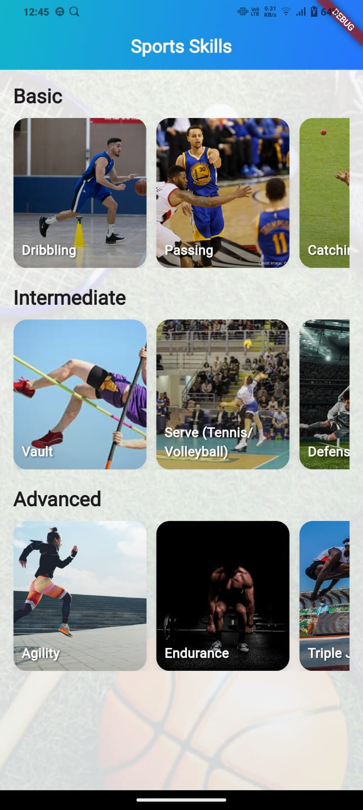

🏀 Sports Skills Carousel 

This Flutter project was built as part of the Flutter Developer Internship assignment.
It displays a list of sports skills (from JSON) grouped by level: Basic, Intermediate, Advanced.
Each category is shown in a horizontal carousel, with clean cards containing an image and skill name.

✨ Features

📂 JSON Parsing & Grouping → Skills grouped into Basic, Intermediate, Advanced

🎨 Clean UI/UX → Rounded skill cards with shadows and responsive layout

🖼️ High-quality images → Relevant sports/action images from Unsplash

🌈 Modern Design → Gradient AppBar + subtle background theme

📱 Responsive & Smooth → Works on multiple screen sizes with smooth horizontal scrolling

🚀 Tech Stack

Flutter (Dart)

Material 3 Widgets

Unsplash (free images)

📷 Screenshots

  

🎞️ Demo Preview

Inline GIF preview of the UI:

  

